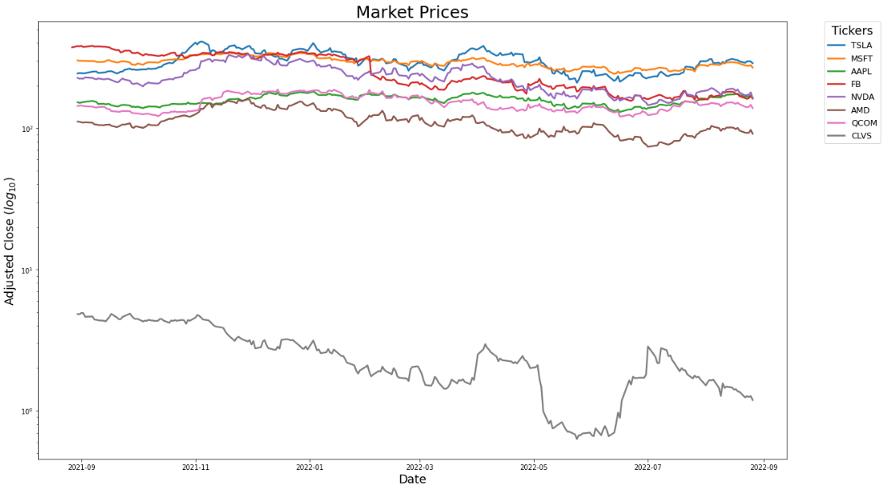
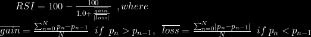
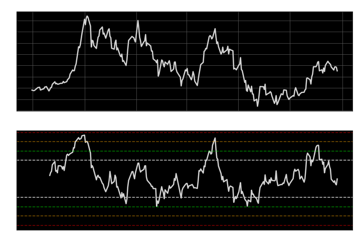
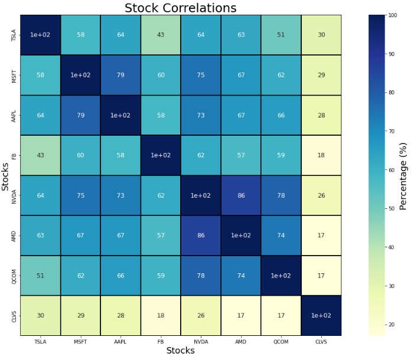
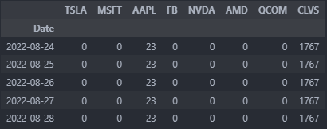
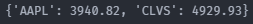
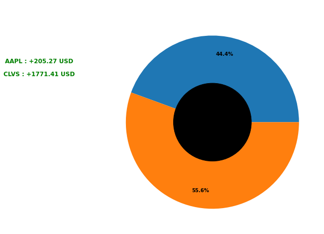

# Stock Market Exploration

## Contents
* [Overview](#Overview)
* [Market](#Market)
    * [RSI](#Relative-Strength-Index-(RSI))
    * [Stock Correlations](#Stock-Correlations)
* [Portfolio](#Portfolio)
    * [Example](#Example)
    * [Preview](#Preview)
* [Credit](#Credit)

## Overview

An exploration of historical records and investor activity for the stock market. The records are pulled from [(`yahoo-finance`)](https://ca.finance.yahoo.com/) API.

## Market

In this analysis, we are primarily considering the $adjusted$ $closing$ prices over the past $365$ days</i>.

This graph above is produced to show the price fluctuations from this time period.

### Relative Strength Index (RSI)

We have visualized the stock prices for an individual ticket along with its $RSI$.

### Stock Correlations

We have included a `seaborn` heatmap of the $Pearson$ $correlation$ between the stock prices. These are expressed as a $percentage$ here.

## Portfolio

An exploration of investor activity is implemented through modification of the `portfolio dataframe` variable :

### Example

Here is an example of a stock portfolio I had for a period of time, as well as the effective balances on $2022-08-28$.

    
    

### Preview

We are implementing functionality for a `matplotlib` pie chart to display a portfolio preview here.

## Credit

The following links were consulted as reference in this exploration.

* [NeuralNine Youtube Channel](https://www.youtube.com/playlist?list=PL7yh-TELLS1HJzPsb6Xjdse2zbyQ-ocDH)