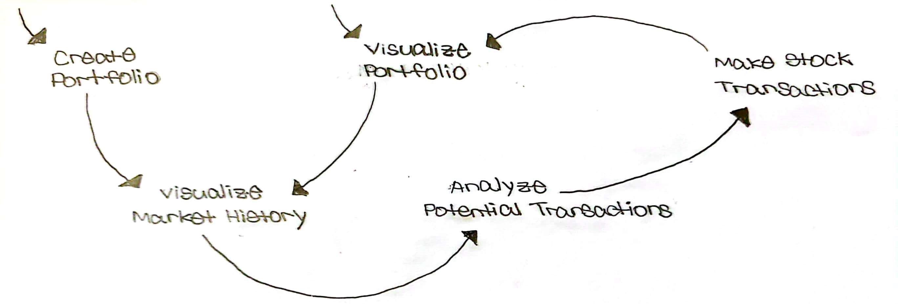
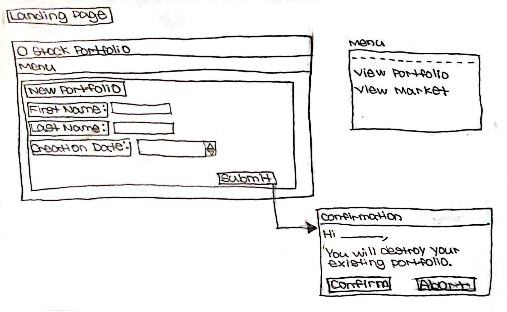
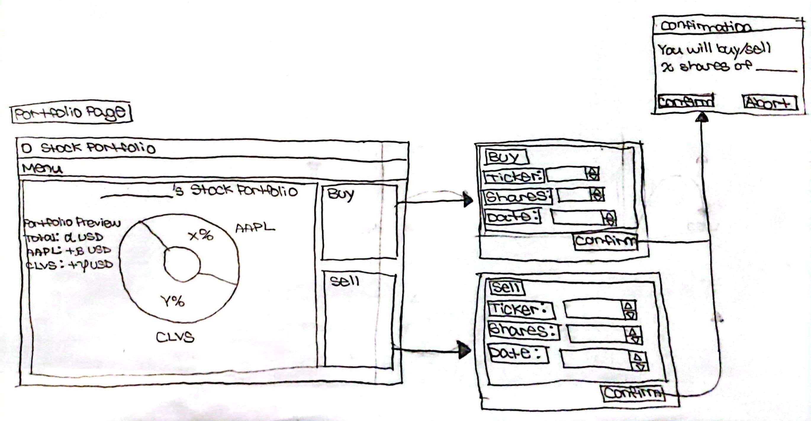
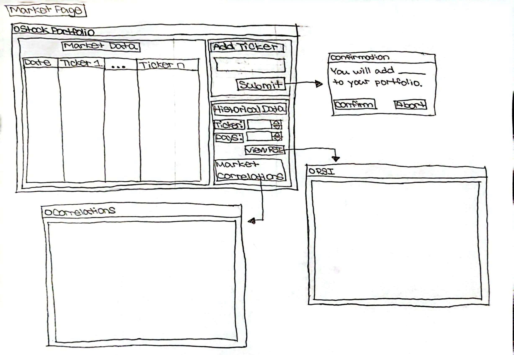
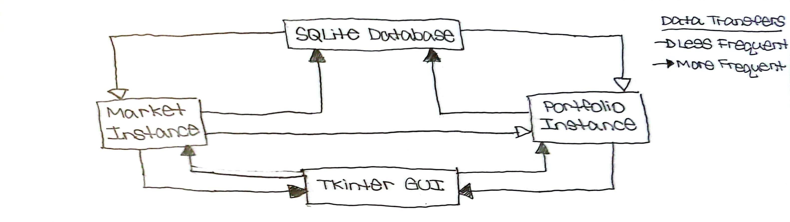
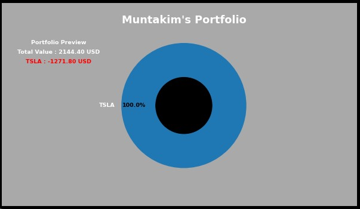
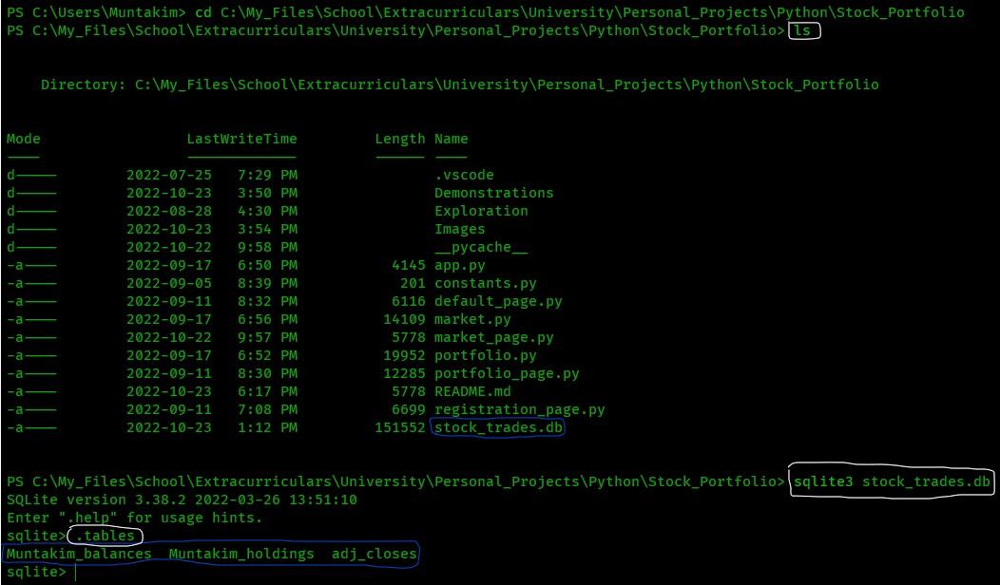
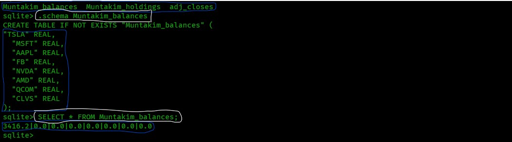

# Stock Portfolio App

## Contents

* [Overview](#Overview)
    * [Inspiration](#Inspiration)
* [Design](#Design)
    * [User Journey](#User-Journey)
        * [Persona](#Persona)
        * [Journey Map](#Journey-Map)
    * [Data Flow](#Data-Flow-Diagram)
* [Implementation](#Implementation)
    * [Tradeoffs](#Tradeoffs)
    * [Classes](#Classes)
        * [Current Portfolio](#Current-Portfolio)
    * [SQLite Database](#SQLite-Database)
* [Demonstration](#Demonstration)
* [Credit](#Credit)

## Overview

Develop **Desktop App** driven by **Python** to collect stock data in local **SQLite** database, analyze market trends, visualize stock portfolio activity, and inform my personal transaction behavior.  

<em>This application is a work-in-progress. It has not been fully developed and consists of software bugs. It can currently be run with limited functionality.</em>

### Inspiration

This was inspired primarily by my interest in visualizing and informing my decision-making for my personal **Tax Free Savings Account (TFSA)** investments. <u>These data insights are not intended to provide professional investment advice</u>. 

I am a student interested in the technologies used in this application - this in addition serves to practice software design and development when analyzing quantitative data.</em>

## Design

Let's go over the intended usage and functionality of our final application.

## User Journey

We're going to zoom out a little bit and consider a simplified <em>user journey</em> when interacting with this application.
### Persona

Let's start by going over the target user **Jack**, based upon my personal

    <em>
        <b>Jack - "A personal investor interested in optimizing their portfolio returns from historical data."</b>
    </em>

It is good practice (and necessary) to consider the actions both preceding and following interaction with the application in depicting the overall journey. I'll have to do more investigation to understand when I typically access my **TFSA** account and how this may influence the design. In general, I am certain that a **Mobile App** would be most accomodating for an enhanced <em>user experience</em>. For learning purposes, let's continue with the **Desktop App** due to reduced development effort.

### Journey Map

The following <em>user journey map</em> depicts potential workflows we're looking to accomplish through this application.

We intend to create a portfolio during our first interaction. From here on, we're looking to visualize our current portfolio upon starting the application.

- User Journey <i>0</i> :
    - Create Portfolio
    - Visualize Market History
    - <em>Analyze Potential Transactions (TBD)</em>
    - Make Stock Transactions
- User Journey <i>1 ... n</i> :
    - Visualize Portfolio
    - Visualize Market History
    - <em>Analyze Potential Transactions (TBD)</em>
    - Make Stock Transactions ...

The pages have been wireframed based on the <em>user journey</em>. In general, we want related actions to be on a single page so that the app is accomodating to Jack's mental space.

<table>
  <tr>
    <th><h2>Pages</h2></th>
    <th><h2>Functionality</h2></th>
  </tr>
  <!-- LandingPage -->
  <tr>
    <td></td>
    <td><h3>Create Portfolio</h3></td>
  </tr>
  <!-- PortfolioPage -->
  <tr>
    <td></td>
    <td>
        <ul>
            <h3>
                <li>Visualize Portfolio
                <li><em>Analyze Potential Transactions (TBD)</em>
                <li>Make Stock Transactions
            </h3>
        </ul>
    </td>
  </tr>
  <!-- MarketPage -->
  <tr>
    <td></td>
    <td><h3>Visualize Market History</h3></td>
  </tr>
</table>

Lets take a look at this **Data Flow Diagram (DFD)**: 

We've designed the <em>application backend</em> to account for : 

<ul>
    <li>Data Consistency (i.e. Between <b>SQLite</b> database <em>-></em> <b>GUI</b>)</li>
    <li>Data Sparsity (i.e. Is the market closed? Has the stock gone public at this date?)</li>
</ul>

## Implementation

This **Desktop App** was preceded by an exploratory **Notebook** in the [(`Exploration`)](Exploration) repository. The application itself was developed off of reusable code from a previous [Electrical Company](https://github.com/Dipto9999/Electrical_Company) project. This was heavily refactored and modified to incorporate our intended functionality.

### Tradeoffs

During development testing, I realized that **Python** and **SQLite** data transfers result in high system latency. Although convenient for data analytics, visualization, as well as the local database connection, there are most likely faster alternatives for implementation.

### Classes

Through utilization of **Python**'s **Object Oriented Programming (OOP)** structure, we have abstracted the app functionality in the following components :

* [Market](market.py)
* [Porfolio](portfolio.py)
* [GUI](app.py)

The [(`app.py`)](app.py) <b>Python</b> file must be run to add, delete, or modify portfolios.

#### Current Portfolio

When running the application, we can see here that our portfolio is at a **$1272.8 USD** unrealized loss with a total value of **$2144.4 USD** and is composed exclusively of **TSLA** shares.

    

### SQLite Database

We have included the **SQL** tables in the [(`stock_trades.db`)](stock_trades.db) **SQLite** database.

We run the `sqlite3 stock_trades.db` and `.tables` commands to identify our table names as specified in the [(`market.py`)](market.py) and [(`portfolio.py`)](portfolio.py) modules.

    

Let's query the `Muntakim_balances` table.

    

We can see here that our **TSLA** balance (i.e. deposited amount) is **$3416.2**. This is consistent with the data from the portfolio visualization.

## Demonstration

Here is a demo of real time interaction with the application.

## Credit

The following links were consulted as reference in this exploration.

* [NeuralNine Youtube Channel](https://www.youtube.com/playlist?list=PL7yh-TELLS1HJzPsb6Xjdse2zbyQ-ocDH)